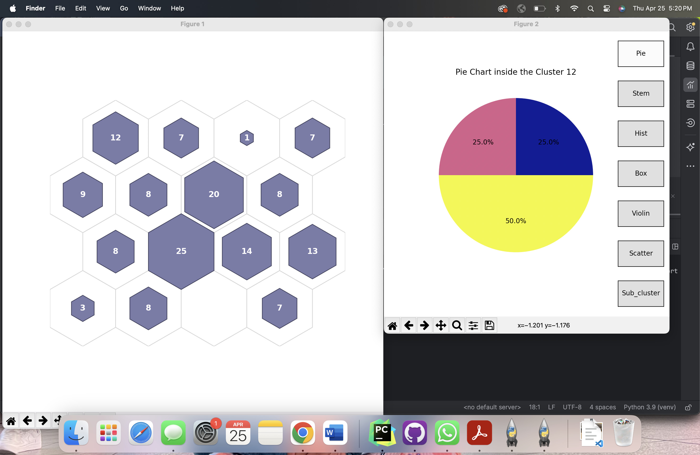

.. _static-page:

Iris Interactive Plots
======================

Introduction
------------

You will see the tutorial for the implementation of interactive plots using NNSOM

Training
--------
Refer Iris Training to see how to train the model before plotting

Data Preparation
----------------
Just make sure you are setting the mouse_click flag to True to see interactive plots.

.. code-block:: python

    num1 = get_cluster_array(X[:, 0], clust)
    num2 = get_cluster_array(X[:, 1], clust)
    cat = count_classes_in_cluster(y, clust)

    perc_sentosa = get_perc_cluster(y, 0, clust)
    iris_class_counts_cluster_array = count_classes_in_cluster(y, clust)
    align = np.arange(len(iris_class_counts_cluster_array[0]))
    num_classes = count_classes_in_cluster(y, clust)
    num_sentosa = num_classes[:, 0]

    int_dict = {
        'data': X,
        'target': y,
        'clust': clust,
        'num1': num1,
        'num2': num2,
        'cat': cat,
        'topn': 5,
    }

    # Interactive hit histogram
    fig, ax, patches, text = som.hit_hist(X, mouse_click=True, **int_dict)
    plt.show()

Output:
^^^^^^^

.. figure:: images_int/iris_interactive_0_0.jpg
   :alt: Plot Output 1
   :width: 500px
   :align: center

   Initial interactive window (on clicking cluster center opens a menu)

   Clustered items as pie chart ( on clicking pie )

   Clustered items as stem plot ( on clicking stem )

Conclusion
----------

In this example we see the implementation of hit histogram to see whats inside the cluster.
We can follow the same for all plots by just setting the flag mouse_click = True